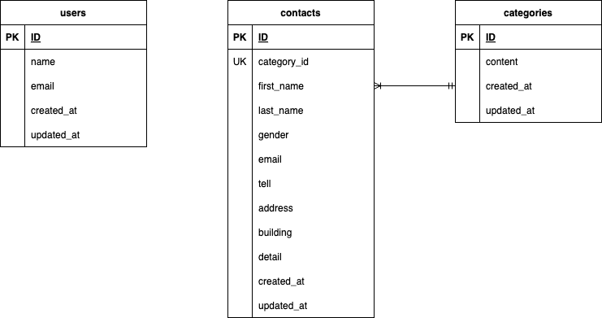

# practice_confirm_test_20250106

## 環境構築
**Dockerビルド**
1. `git clone git@github.com :git@github.com:butterfly-39/practice_confirm_test_20250106.git`
2. DockerDesktopアプリを立ち上げる
3. `docker-compose up -d --build`
> *Mac の M1・M2 チップの PC の場合、「マニフェスト リスト エントリに linux/arm64/v8 に一致するマニフェストがありません」のメッセージが表示されビルドができないことがあります。エラーが発生する場合は、docker- compose.yml ファイルの「mysql」内に「platform」の項目を追加で記載してください*
```bash
mysql:
platform: linux/arm64/v8(この文追加)
image: mysql:8.0.33
environment:
```
**Laravel環境構築**
1. docker-compose exec php bash
2. composer -v
3. 「.env.example」ファイルを「.env」ファイルに命名を変更。または、新しく.envファイルを作成
4. .envに以下の環境変数を追加
```bash
DB_CONNECTION=mysql
DB_HOST=mysql
DB_PORT=3306
DB_DATABASE=laravel_db
DB_USERNAME=laravel_user
DB_PASSWORD=laravel_pass
```
5. アプリケーションキーの作成
```bash
php artisan key:generate
```
6. マイグレーションの実行
```bash
php artisan migrate
```
7. シーディングの実行
```bash
php artisan db:seed
```
## 使用技術(実行環境)
・PHP8.2.0
・Laravel10.0.0
・MySQL8.0.33

## ER図


## URL
・開発環境：http://localhost:83/
・phpMyAdmin：http://localhost:8083/
